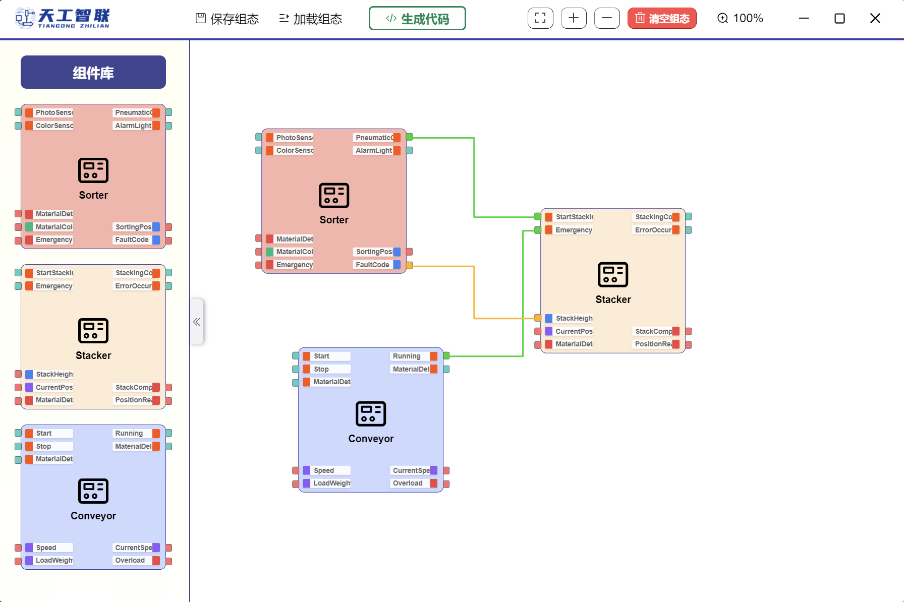

# AI3705-IndustrialNetworkFinalProject

<p align="center">
  
</p>

**SJTU 2024-2025 Spring AI3705 工业互联网 期末大作业**

## 项目介绍

<p align="center">
  
  
</p>

本项目实现了一个工业互联网平台，提供给用户高效的工业流程设备、组态生成以及便捷的IEC 61499代码生成功能。用户可以用自然语言描述项目需求，系统将根据需求自动配置设备块，并提供给用户可以编辑的画布界面。用户可以在画布上进行组态编辑，完成后系统将自动生成IEC 61499代码，并支持直接上传到FBB IDE中进行测试。

## 技术栈

项目使用web技术进行开发

- 前端：`Vue.js`, `Element Plus`, `Electron`
- 后端：`FastAPI`

## 运行与打包

### 大模型API配置

在运行项目之前，请确保已配置好大模型API的相关信息。你需要在`in_backend/config.yaml`中填好所有的配置项，包括API密钥、模型名称等（兼容`OpenAI`库的接口）。

### 前端

1. 安装Node.js和npm
   - 请参考 [Node.js官网](https://nodejs.org/) 进行安装。
  
2. 安装依赖

   ```bash
    cd in_frontend
    npm install
   ```

3. 启动前端服务

   ```bash
    npm run electron:serve
   ```

### 后端

1. 安装Python和pip
   - 请参考 [Python官网](https://www.python.org/) 进行安装。

2. 安装依赖

   ```bash
    cd in_backend
    pip install -r requirements.txt
   ```

3. 启动后端服务

   ```bash
   python main.py
   ```

### 打包

执行以下命令将前端和后端打包成可执行文件：

```bash
./pack.bat
```
